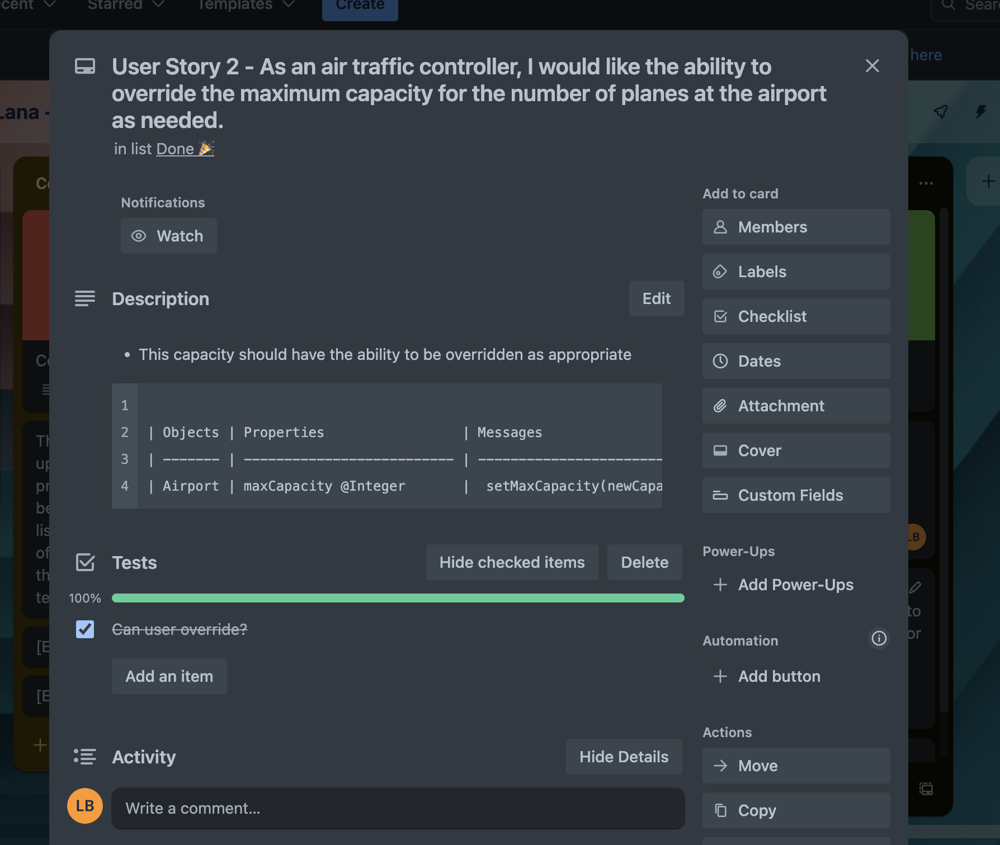
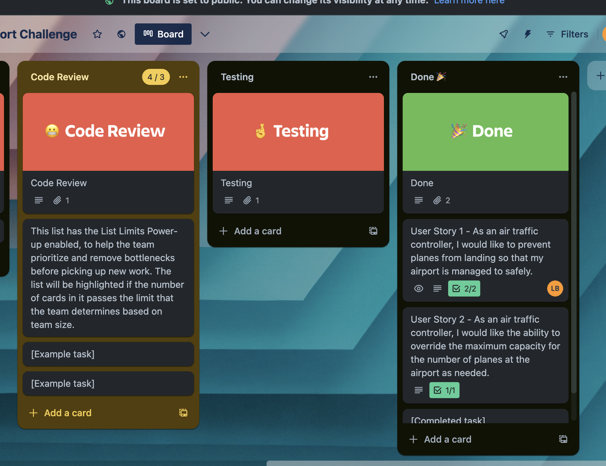

# Domain Models and Test Plan

**Domain Model for User Story 1:**

 - As an air traffic controller, I want to prevent airplanes from landing when my airport is full.

| Objects | Properties         | Messages              | Outputs              |
| ------- | ------------------ | --------------------- | -------------------- |
| Airport | maxCapacity @Integer | can plane land?       | 'True' or 'false'    |

**Domain Model User Story 2:**

- As an air traffic controller, I would like the ability to override the maximum capacity for the number of planes at the airport as needed.

| Objects | Properties                 | Messages                           | Outputs                    |
| ------- | -------------------------- | ---------------------------------- | --------                   |
| Airport | maxCapacity @Integer       |  setMaxCapacity(newCapacity)       | 'True' or 'false'          |

# Agile Evidence for User Story 2: 

The below is evidence of using Agile methodologies. The below images are from my Kan ban (It would not allow me to type the full word) board which has been used throughout the process to ensure agile practices have been used. 

References for both images: https://trello.com/b/5VeEqVdy/lana-airport-challenge

**Domain Model for User Story 3:**

- As an Air Traffic Controller, I want to know the current number of planes at the airport

| Objects | Properties           | Messages              | Outputs            |
| ------- | -------------------- | --------------------- | ------------------- |
| Airport | maxCapacity @Integer | getCurrentCapacity()  | Integer (Number of planes) |

**Domain Model for User Story 4:**

- As an Air Traffic Controller, I want to be able to get the current number of planes at the airport and also know which planes have landed.

| Objects | Properties           | Messages         | Outputs            |
| ------- | -------------------- | ----------------- | ------------------- |
| Airport | maxCapacity @Int     | getCurrentCapacity() | Int(Number of planes
|         | landedPlanes @Object | -                 | Object (Planes and IDs)   |

**Domain Model for User Story 5:**

 - As an Air Traffic Controller, I want to have visibility into the current planes at the airport and their respective IDs

| Objects   | Properties               | Messages            | Outputs            |
| --------- | ------------------------ | ------------------- | 
| Airport   | currentCapacity @Int  | getCurrentPlanes()  | Array of plane IDs |

**Domain Model for User Story 6:**

- As an Air Traffic Controller, I want to override the maximum capacity for the number of planes at the airport.

| Objects | Properties       | Messages                      | Outputs            |
| ------- | ---------------- | ---------------------         | 
| Airport | maxCapacity @Int | setMaxCapacity(newCapacity    | 'True' or 'false'  |

----------------------
**Domain Model for User Story 7 - AI Generated:**

- As an Air Traffic Controller, I want to ensure that planes cannot land or take off in stormy weather conditions.

I used ChatGPT to do this for me, by posting in one I had done before, I also posted in my plane class and my airport class and it told me to do a weather.js.

--------------------------------------------------------------
| Objects             | Properties           | Messages        | Outputs |
--------------------------------------------------------------
| Air Traffic         |                      |                 |         |
| Controller          |                      |                 |         |
|---------------------|----------------------|-----------------|---------|
| Airport             | maxCapacity @Int     | canLand()       | 'True' or 'false' |
|                     | currentCapacity @Int | canTakeOff()    | 'True' or 'false' |
|                     | landedPlanes @Object | setStormyWeather() | 'True' or 'false' |
|---------------------|----------------------|-----------------|---------|
| Plane               | planeId @Int         |                 |         |
|                     | isFlying @Boolean    |                 |         |
|---------------------|----------------------|-----------------|---------|
| Weather             | isStormy @Boolean    |                 |         |
|---------------------|----------------------|-----------------|---------|

Evidence:

**Domain Model for User Story 8:**

- As an Air Traffic Controller, I want to have the ability to remove a plane from the airport when necessary. 

| Objects | Properties        | Messages                   | Outputs           |
| ------- | ----------------- | --------------------------- | ----------------- |
| Airport | maxCapacity @Int | removePlane(planeId) | 'True' or 'false' |

**Domain Model for User Story 9:**

- As an Air Traffic Controller, I want to prevent a plane that is already at the airport from landing again. 

| Objects | Properties       | Messages                      | Outputs            |
| ------- | ---------------- | ---------------------         | 
| Airport | maxCapacity @Int | canLand()                    | 'True' or 'false'  |
          | currentCapacity   | instructPlaneToLand(plane)   | 'True' or 'false'  |

**Domain Model for User Story 10 :**

- As an Air Traffic Controller, I want to ensure that I cannot instruct a plane to take off if it is not currently at the airport.

| Objects | Properties        | Messages                    | Outputs           |
| ------- | ----------------- | --------------------------- | ----------------- |
| Airport | maxCapacity @Int | preventPlaneFromLanding(planeId) | 'True' or 'false' |

**Domain Model for User Story 10:**

- As an Air Traffic Controller, I want to ensure that I cannot instruct a plane to take off if it is not currently at the airport.

| Objects | Properties       | Messages                      | Outputs            |
| ------- | ---------------- | ---------------------         | 
| Airport | maxCapacity @Int | canTakeOff()                 | 'True' or 'false'  |
          | currentCapacity   | instructPlaneToDepart(plane) | 'True' or 'false'  |

**Domain Model for User Story 11:**

As an Air Traffic Controller, I want to ensure that if the airport is at full capacity, a plane cannot land. 

| Objects | Properties       | Messages                 | Outputs            |
| ------- | ---------------- | -------------------------| ------------------- |
| Airport | maxCapacity @Int | instructPlaneToLand()   | 'True' or 'false'  |

--------------------------------------------------------------------
All of the below were generated via ChatGPT, formatting is off on github website!
--------------------------------------------------------------------
**USER STORY 12 - AI GENERATED USING CHATGPT**

As an Air Traffic Controller, I want to attempt to land a plane when the airport is full, and I want to handle this situation gracefully.

Objects            | Properties         | Messages                    | Outputs
-----------------------------------------------------------------------
Air Traffic Controller
Airport             | maxCapacity        | canLand()                   | 'True' or 'false'
currentCapacity     |                    | instructPlaneToLand(plane)  | 'True' or 'false'
landedPlanes        |                    |                             |
-----------------------------------------------------------------------

**USER STORY 13 - AI GENERATED USING CHATGPT** 

- As an Air Traffic Controller, I want to attempt to remove a plane that hasn't landed, and I want to handle this situation gracefully.

Objects            | Properties         | Messages                    | Outputs
-----------------------------------------------------------------------
Air Traffic Controller
Airport             | maxCapacity        | removePlane(planeId)        | 'True' or 'false'
currentCapacity     |                    |                             |
landedPlanes        |                    |                             |
----------------------------------------------------------------------

**USER STORY 14 - AI GENERATED USING CHATGPT** 

- As an Air Traffic Controller, I want to attempt to instruct a plane to take off when it's not currently at the airport, and I want to handle this situation gracefully.

Objects            | Properties         | Messages                    | Outputs
-----------------------------------------------------------------------
Air Traffic Controller
Airport             | maxCapacity        | canTakeOff()                | 'True' or 'false'
currentCapacity     |                    | instructPlaneToDepart(planeId) | 'True' or 'false'
landedPlanes        |                    |                             |
-----------------------------------------------------------------------
